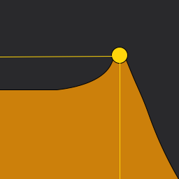

# About LPF (Low-pass Filter)

This project is an adaptation of Apple's [Creating Custom Audio
Effects](https://developer.apple.com/documentation/audiotoolbox/audio_unit_v3_plug-ins/creating_custom_audio_effects)
project. Much has been retooled for a better experience and code understanding, as well as various bug fixes.
You can find Apple's original README [here](Documentation/APPLE_README.md)

The gist is still the same:

* use a C++ kernel for audio sample manipulation in the render thread
* provide a tiny Obj-C interface to the kernel for Swift access
* perform all UI and most audio unit work in Swift (usually on the main thread)

Unlike Apple's example, this one uses the [Accelerate](https://developer.apple.com/documentation/accelerate)
framework to perform the filtering (Apple's code clearly shows you what the Biquadratic IIR filter does, just in
a slightly less performant way).

The code was developed in Xcode 11.5 on macOS 10.15.5. I have tested on both macOS and iOS devices primarily in
GarageBand, but also using test hosts on both devices as well as the excellent
[AUM](https://apps.apple.com/us/app/aum-audio-mixer/id1055636344) app on iOS.

Finally, it passes all
[auval](https://developer.apple.com/library/archive/documentation/MusicAudio/Conceptual/AudioUnitProgrammingGuide/AudioUnitDevelopmentFundamentals/AudioUnitDevelopmentFundamentals.html)
tests.

## Code Layout

Each OS ([macOS](macOS) and [iOS](iOS)) have the same code layout:

* `App` -- code and configury for the application that hosts the AUv3 app extension
* `Extension` -- code and configury for the extension itself
* `Framework` -- code configury for the framework that contains the shared code by the app and the extension

The [Shared](Shared) folder holds all of the code that is used by the above products. In it you will find

* [BiquadFilter](Shared/Kernel/BiquadFilter.hpp) -- the C++ class that manages the filter state.
* [FilterDSPKernel](Shared/Kernel/FilterDSPKernel.hpp) -- another C++ class that does the rendering of audio samples by sending them through the filter.
* [FilterAudioUnit](Shared/FilterAudioUnit.swift) -- the actual AUv3 AudioUnit written in Swift.
* [FilterView](Shared/User Interface/FilterView.swift) -- a custom view (UIView and NSView) that draws the frequency response curve for the current filter
settings. It also allows for dynamically changing the filter settings by touch (UIView) or mouse (NSView).
* [FilterViewController](Shared/User Interface/FilterViewController.swift) -- a custom `AUViewController` that creates new `FilterAudioUnit` instances for 
the host application.

Additional supporting files can be found in `Support`.

# Examples
Here is LPF shown running in GarageBand on macOS:

For the LPF AUv3 Audio Unit to be available for use in GarageBand or any other Audio Unit "host" application,
the LPF app must be built and (probably) run. The macOS will detect the app extension declared in the app, and
register it for use by any other application that wants to work with AUv3 Audio Unit components.

The same applies to iOS Audio Units. First, build and then run the app on a device (simulators can run the app,
but you won't be able to run GarageBand or AUM there.) Next, fire up your host app, and you should be able to
add LPF as a signal processing effect.

On GarageBand for iOS, there are three buttons in blue at the bottom of the AudioUnit view. The one on the left
("Warm") shows the current preset, and clicking on it will let you change it or let you save the current
settings to a new one. The two buttons on the right let you show an alternate control view (one provided by
GarageBand itself), and expand the existing view to use the entire height of the display.

