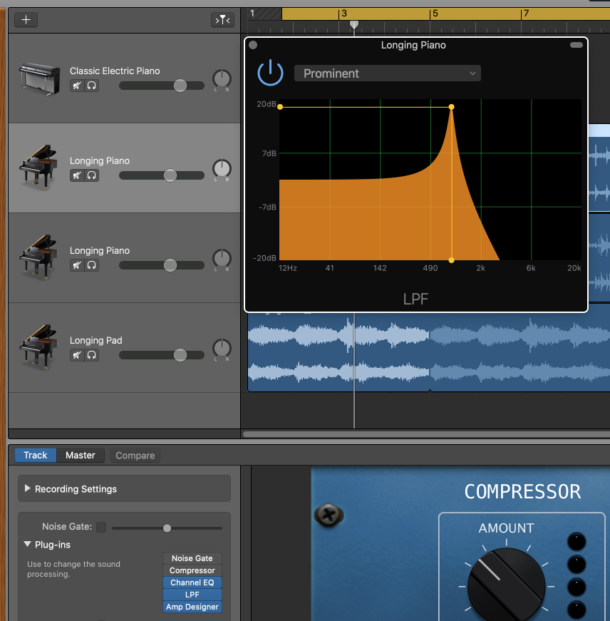
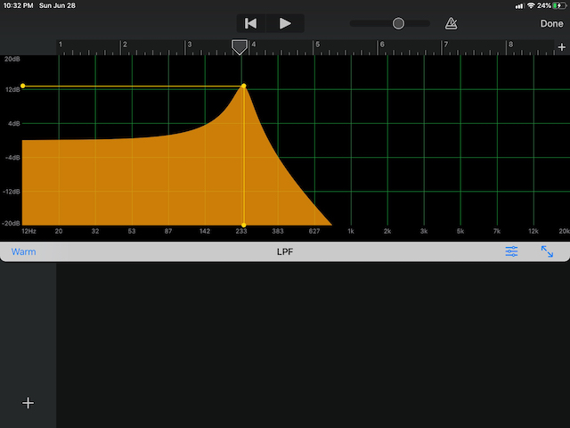
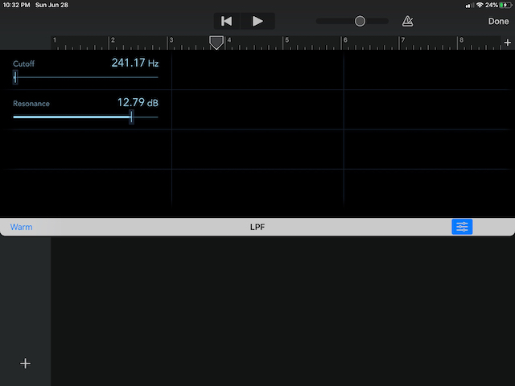

# About SimplyLowPass

This project is an adaptation of Apple's [Creating Custom Audio
Effects](https://developer.apple.com/documentation/audiotoolbox/audio_unit_v3_plug-ins/creating_custom_audio_effects)
project. Much has been retooled for a better experience and code understanding, as well as various bug fixes. You can
find Apple's original README [here](Documentation/APPLE_README.md)

The gist is still the same as in the original:

* use an Objective-C/C++ kernel for audio sample manipulation in the render thread
* provide a tiny Objective-C interface to the kernel for Swift access
* perform all UI and most audio unit work in Swift on the main thread
* communicate between kernel and UI using AUParameterTree

Unlike Apple's example, this one uses the [Accelerate](https://developer.apple.com/documentation/accelerate)
framework to perform the filtering (Apple's code clearly shows you what the Biquadratic IIR filter does, just in
a slightly less performant way).

The code was developed in Xcode 11.5 on macOS 10.15.5. I have tested on both macOS and iOS devices primarily in
GarageBand and Logic, but also using test hosts on both devices as well as the excellent
[AUM](https://apps.apple.com/us/app/aum-audio-mixer/id1055636344) app on iOS.

Finally, it passes all
[auval](https://developer.apple.com/library/archive/documentation/MusicAudio/Conceptual/AudioUnitProgrammingGuide/AudioUnitDevelopmentFundamentals/AudioUnitDevelopmentFundamentals.html)
tests. (`auval -v aufx lpas BRay`)

If you are interested in making your own AUv3 components, feel free to fork this and adapt to your needs. However a
better option might be to check out my [AUv3Template](https://github.com/bradhowes/AUv3Template) repo which provides the
same base functionality in iOS and macOS but allows for easier customization via the included `build.py` Python script.

## Demo Targets

The macOS and iOS apps are simple AUv3 hosts that demonstrate the functionality of the AUv3 component. In the AUv3
world, an app serves as a delivery mechanism for an app extension like AUv3. When the app is installed, the operating
system will also install and register any app extensions found in the app.

The `SimplyLowPass` apps attempt to instantiate the AUv3 component and wire it up to an audio file player and the output
speaker. When it runs, you can play the sample file and manipulate the filter settings -- cutoff frequency in the
horizontal direction and resonance in the vertical. There are also a collection of factory presets that you can choose
which will apply canned settings. On macOS these are available via the `Presets` menu; on iOS there is a segment control
that you can touch to change to a given factory preset.

Finally, the AUv3 component supports user-defined presets, and the simple host apps offer a way to create, update, 
rename, and delete them. On macOS, these functions are at the top of the `Presets` menu, followed by the factory
presets, and then any user-defined presets (there is also a button on the window that shows the same menu). The iOS app
offers the same functionality in a pop-up menu to the right of the factory presets segmented control.

## Code Layout

Both [macOS](macOS) and [iOS](iOS) have the same code layout:

* `App` -- code and configury for the application that hosts the AUv3 app extension. Again, the app serves as a demo
host for the AUv3 app extension.
* `Extension` -- code and configuration for the extension itself

The common code is found in various Swift packages under [Packages](Packages) -- including the Objective-C++ kernel
code. There are six packages:

* [Kernel](Packages/Sources/Kernel) -- holds the signal processing kernel that does the rendering
* [KernelBridge](Packages/Sources/KernelBridge) -- a tiny Objective-C class for Swift bridging
* [ParameterAddress](Packages/Sources/ParameterAddress) -- holds the parameter IDs and definitions for
the kernel controls
* [Parameters](Packages/Sources/Parameters) -- holds the parameter collection which includes the list of factory presets
* [Theme](Packages/Sources/Theme) -- some attributes that affect the display of the app and app extensions.
* [UI](Packages/Sources/UI) -- the graphical display for the kernel used by both the macOS and iOS extensions

The apps and AUv3 app extensions depend on my Swift package [AUv3Support](https://github.com/bradhowes/AUv3Support)
which provides a common AUv3 hosting environment for both iOS and macOS as well as a common infrastructure for any AUv3
filter component.

# Examples

Here is LPF shown running in GarageBand on macOS:

For the LPF AUv3 Audio Unit to be available for use in GarageBand or any other Audio Unit "host" application,
the LPF app must be built and (probably) run. The macOS will detect the app extension declared in the app, and
register it for use by any other application that wants to work with AUv3 Audio Unit components.

The same applies to iOS Audio Units. First, build and then run the app on a device (simulators can run the app,
but you won't be able to run GarageBand or AUM there.) Next, fire up your host app, and you should be able to
add LPF as a signal processing effect.

On GarageBand for iOS, there are three buttons in blue at the bottom of the AudioUnit view. The one on the left
("Warm") shows the current preset, and clicking on it will let you change it or let you save the current
settings to a new one. The two buttons on the right let you show an alternate control view (one provided by
GarageBand itself), and expand the existing view to use the entire height of the display.

